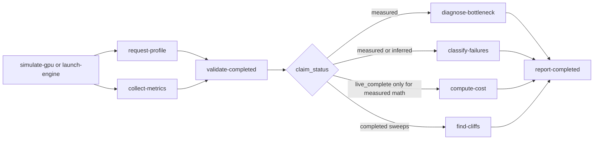

# InferGuard architecture

This page is the operator-oriented architecture overview. The detailed schema and historical architecture authority remains [`SPEC.md`](SPEC.md); this page is intentionally shorter and optimized for OSS readers deciding how the pieces fit together.

## One-sentence architecture

InferGuard is a read-only evidence pipeline: launch or observe a serving stack, collect request/engine/GPU artifacts, validate whether the evidence is publishable, then produce diagnosis, failure, cost, cliff, and recommendation reports only when the claim status allows it.

## Evidence pipeline



The most important boundary is `validate-completed`: downstream commands can still run on incomplete input, but they must downgrade claims or refuse operator recommendations when the required evidence is missing.

## Fourteen core modules

| Module | Primary command(s) | Responsibility |
|---|---|---|
| `inferguard.cli` | all commands | Typer entrypoint, command wiring, shared signal handling, stdout summaries. |
| `inferguard.io` | shared | Atomic writes, tolerant JSON readers, JSONL flushing, partial-results registration, child-process cleanup. |
| `inferguard.preflight` | `preflight` | Read-only model/engine compatibility checks and tokenizer mismatch probes. |
| `inferguard.synthetic` | `simulate-gpu` | Synthetic GPU/Slurm bundle generation for local smoke tests. |
| `inferguard.launch_engine` | `launch-engine` | vLLM/SGLang/LMCache/Dynamo-SGLang command capture, external validation, healthcheck artifacts, process cleanup. |
| `inferguard.request_profile` | `request-profile` | OpenAI-compatible request loop with TTFT, TPOT, latency, token, error, and per-field claim evidence. |
| `inferguard.collect_metrics` | `collect-metrics` | Engine Prometheus, LMCache, and DCGM timeline collection. |
| `inferguard.validate` | `validate-completed` | Publishability classification, missing-artifact checks, live-complete quorum, claim downgrades. |
| `inferguard.diagnose_bottleneck` | `diagnose-bottleneck` | Bottleneck verdicts across prefill, decode, KV, queue, network, host, launch, and insufficient evidence. |
| `inferguard.classify_failures` | `classify-failures` | Failure-class regex/evidence ranking from logs and artifacts. |
| `inferguard.report_completed` | `report-completed` | Refusal-gated operator recommendation reports. |
| `inferguard.find_cliffs` | `find-cliffs` | Capacity-envelope and cliff detection across sweeps. |
| `inferguard.cost_model` | `compute-cost` | Cost-per-useful-task and safe concurrency calculations with validation-aware downgrades. |
| `inferguard.agentx_adapter` | `agentx-ingest` | AgentX CSV to canonical InferGuard artifact conversion. |

Adjacent surfaces are still first-class OSS APIs: `inferguard.bench` for replay/KVCast/cold-start/compare workloads, `inferguard.analyze` for existing result trees, `inferguard.disagg` for live Prometheus overlay, `inferguard.profile` for live and retro profile loops, `inferguard.harness` for daemon/agent tracing, `inferguard.router` and `inferguard.workload` for routing, and `inferguard.mcp_server` for MCP tools.

## Claim status enum

Every public artifact that makes an evidence claim must use one of four canonical values:

| `claim_status` | When to use it | Publication meaning |
|---|---|---|
| `synthetic` | Generated by `simulate-gpu`, dry-run fixtures, or synthetic-only smoke tests. | Useful for local validation; not real GPU evidence. |
| `inferred` | Evidence is indirect, partial, or missing one or more proof fields. | Can guide next steps; quote with caveats. |
| `measured` | Live evidence is present and the relevant validation gates pass. | Suitable for measured claims if the artifact set is included. |
| `not_proven` | The claim failed validation or cannot be checked. | Do not publish as a positive claim. |

Non-canonical labels such as `partial`, `downgraded`, or `inferred_without_engine_metrics` may appear only in explanatory fields like `reason`, `claim_reason`, or `claim_caveat`; they must not be emitted as `claim_status`.

## Completed-run statuses

`validate-completed` emits a run-level status and per-job status:

| Status | Meaning |
|---|---|
| `live_complete` | Required live request, launch, engine metrics, and GPU metrics evidence exists. |
| `live_incomplete` | Some live artifacts exist, but the live-complete quorum is not satisfied. |
| `synthetic_only` | Synthetic mimic markers are present and no live evidence supersedes them. |
| `missing_required_artifacts` | Required contract or job artifacts are absent. |
| `not_publishable` | Invalid inputs or synthetic/live conflicts prevent publication. |

A `live_complete` job requires:

1. `request_profile/requests_profile.jsonl` exists, is non-empty, and has at least one successful row;
2. `launch/healthcheck.json` reports status code `200` or an equivalent success state;
3. `metrics/engine_metrics_timeline.jsonl` exists, is non-empty, and contains recognized engine metrics;
4. `metrics/gpu_metrics_timeline.jsonl` exists, is non-empty, and contains required DCGM GPU utilization and framebuffer signals;
5. the artifact contract's required paths are present or explicitly downgraded.

## Artifact layout

A completed run root normally looks like this:

```text
results-root/
  matrix_plan.json
  expected_artifact_contract.json
  validation_report.json
  validation_report.md
  jobs/<job-id>/
    request_profile/requests_profile.jsonl
    request_profile/requests_summary.json
    metrics/engine_metrics_timeline.jsonl
    metrics/gpu_metrics_timeline.jsonl
    metrics/metrics_summary.json
    launch/command.json
    launch/healthcheck.json
    diagnosis/bottleneck_diagnosis.json
    diagnosis/failure_classification.json
    report/operator_recommendation.json
```

Not every command writes every directory. The validator is the authority on which paths are required for a specific matrix or contract.

## Network and safety model

InferGuard does not provision cloud resources and does not phone home by default. Runtime network calls are limited to user-supplied endpoints: OpenAI-compatible chat completions, Prometheus engine metrics, DCGM exporter metrics, prefill/decode/transfer metrics, or explicit telemetry audit commands after consent.

`launch-engine` is the only command that can spawn serving engine subprocesses. v0.7.1 launches workers in their own process group and registers them with shared SIGINT/SIGTERM cleanup so interrupted runs do not leave orphan vLLM/SGLang processes.

## How to extend the architecture

- Add tests first for new artifact contracts, claim-status behavior, and CLI flags.
- Keep new public artifact fields additive or version the schema.
- Update [`CLI_REFERENCE.md`](CLI_REFERENCE.md) when command help changes.
- Update [`HARDWARE_COVERAGE.md`](HARDWARE_COVERAGE.md) when matrix coverage changes.
- Keep private/pro-tier modules outside the OSS import graph; see [`CONTRIBUTING.md`](../CONTRIBUTING.md).
