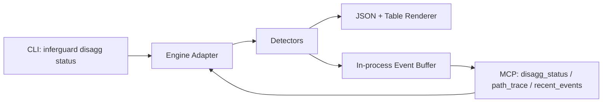

# Architecture

This file is preserved for legacy links. The canonical InferGuard Bench + Analyze architecture specification is **[`SPEC.md`](SPEC.md)**.

> **Read [`SPEC.md`](SPEC.md) instead.** It supersedes this file as of 2026-04-29 (v1.0 consolidation).

For historical context, the original disagg-only architecture diagram is preserved below. New material must update [`SPEC.md`](SPEC.md), not this file.

---

## Legacy disagg-only architecture (superseded)

InferGuard OSS is a read-only diagnostic surface for disaggregated serving.

This diagram covers only the live overlay surface. The current package also includes `inferguard bench` (replay / kvcast / kv-stress) and `inferguard analyze`. See [`SPEC.md`](SPEC.md) §§2–9 for the complete picture.
